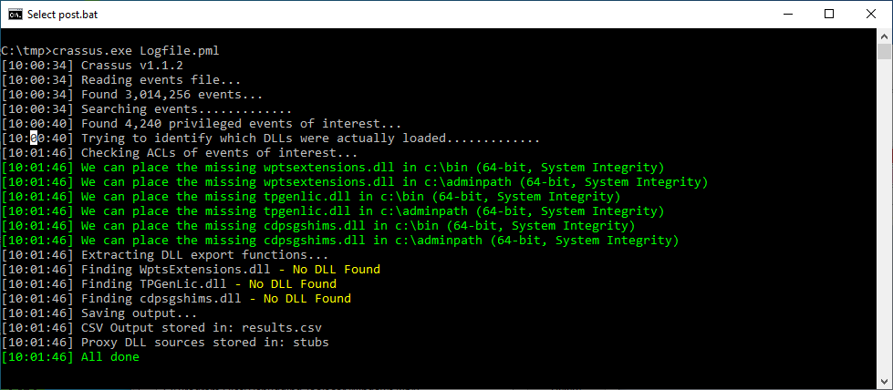
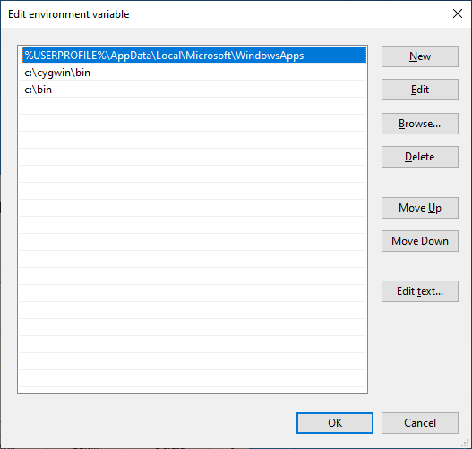
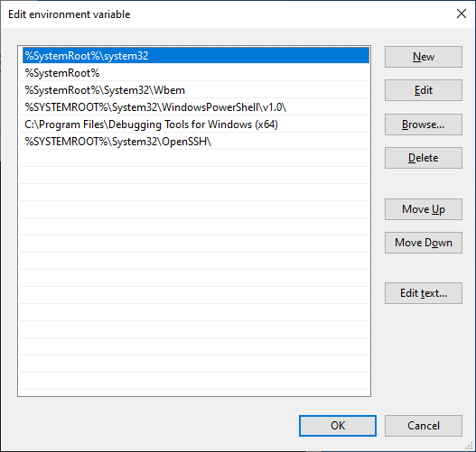
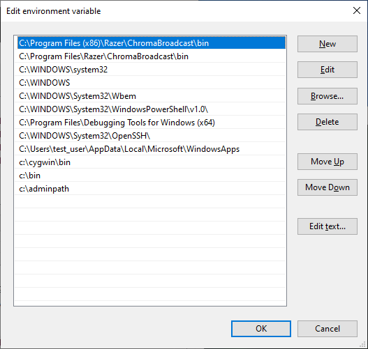
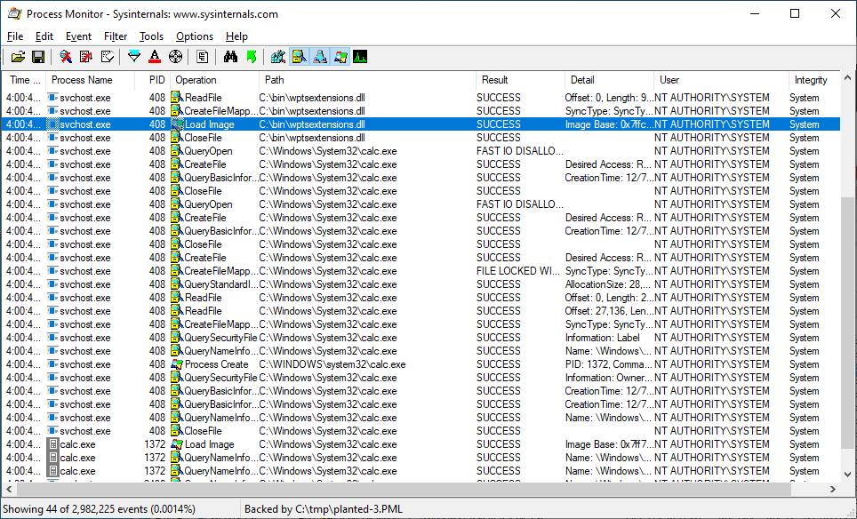

## Description

The Razer Synapse Windows installer’s “Chroma Connect” (and I believe other) sub-components is vulnerable to privilege escalation. Depending on the environment variables of the user to runs the installer, this can result in the ability for a non-admin user to achieve arbitrary code execution with SYSTEM privileges. At the least-severe, the vulnerability may simply allow for a UAC bypass to allow an un-elevated process the ability to run code with SYSTEM privileges.

The main problem is that ths Synapse installer (when run with the optional sub-components installed) will take the **current user’s** PATH environment variable and once done modifying it, it will promote it to be the **system-wide** PATH environment variable. Any user with the ability to place a file in a system-wide PATH directory will have the ability to plant a DLL to achieve code execution with SYSTEM privileges.

The problem with the Razer Synapse installer is that the security of the system is depedent on whether or not the user account who runs the installer has any user-writable directories in their PATH.

Aside from promoting a user-level PATH to a system-wide path, the installer also has two other issues that should perhaps be looked at:

1.  environment variables are escaped. e.g. a PATH entry of `%SystemRoot%\\system32` would be replaced with `C:\\WINDOWS\\system32` after the Razer Synapse installer is complete.
2.  The Razer ChromaBroadcast\\bin directories are added **before** the Windows system32 directory.

While neither of these two issues might lead to direct security issues, they are both considered poor practices and should probably be resolved.

## Steps to Reproduce

1.  Create the directory `C:\\bin`
2.  Add this directory to the **user-level** PATH environment variable who will be installing Razer Synapse.
3.  Install Razer Synapse `RazerSynapseInstaller_V1.12.0.385.exe` with at least the “CHROMA CONNECT” sub-option installed.
4.  Reboot with a Process Monitor boot log enabled.
5.  Filter boot log with path contains `c:\\bin`
6.  Note that several DLLs are attempted to be loaded from `c:\\bin` with SYSTEM-priviliged processes.

Note that this was discovered with the Crassus tool: <https://github.com/vullabs/Crassus>

Screenshots are attached that show the Crassus output, a Procmon log of after `wptsextensions.dll` is planted in the user-writable directory, resulting in `calc.exe` executing with SYSTEM privileges, as well as how the system-wide path is modified using both the system-wide PATH before, being merged with the admin-user PATH.

## Remediation

The affected installer components should **not** use user-level paths as input when constructing the system-wide PATH environment variable.

Additionally, the installer should:

-   Not automatically expand environment variables when modifying the path.
-   Place its own paths at the **end** of any existing PATH entries.

## Attachments
razr_crassus.png  

adminpath_before.png  

systempath_before.png  

razr_systempath_after.png  

razr_planted.png  
